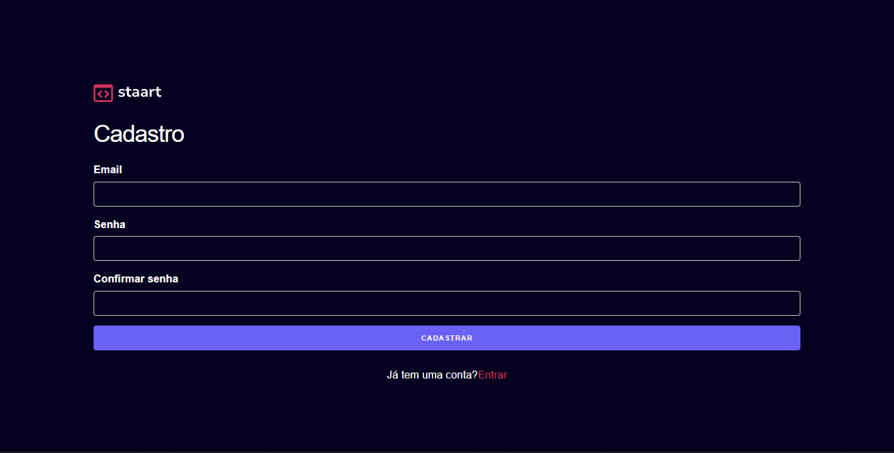

<h1 align="center"> Staart Auth </h1>

  <a href="#-tecnologias">Tecnologias</a>&nbsp;&nbsp;&nbsp;|&nbsp;&nbsp;&nbsp;
  <a href="#-projeto">Projeto</a>&nbsp;&nbsp;&nbsp;|&nbsp;&nbsp;&nbsp;
  <a href="#memo-licença">Licença</a>

  

 

  

## 🚀 Tecnologias

Esse projeto foi desenvolvido com as seguintes tecnologias:

- React
- Firebase
- HTML e CSS
- JavaScript

## 💻 Projeto

Esse projeto é uma demonstração de aplicação que utiliza o Firebase para fazer Login e Cadastro de usuários de uma plataforma. Algumas das features do projeto incluem a possibilidade de trocar o e-mail de cadastro e redefinir a senha.

## :memo: Licença

Esse projeto está sob a licença MIT.

---

Feito com ♥ by Luiz :wave:
